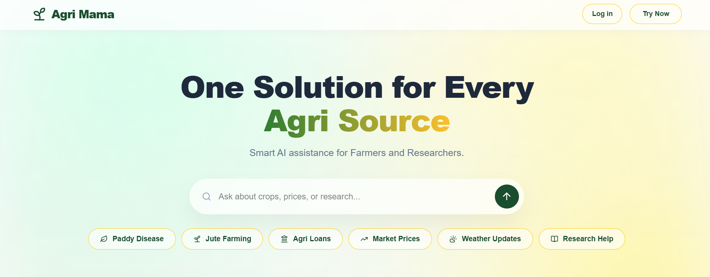
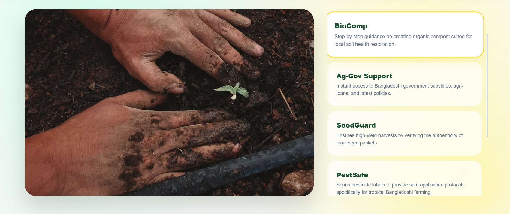
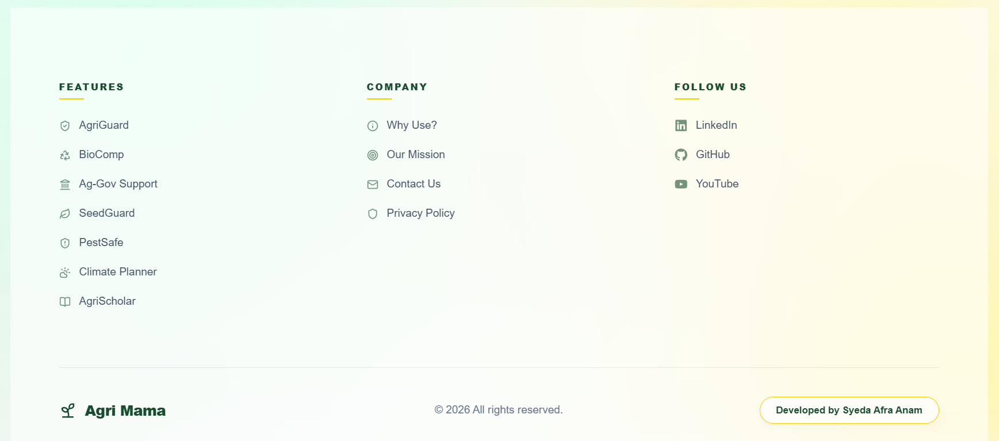
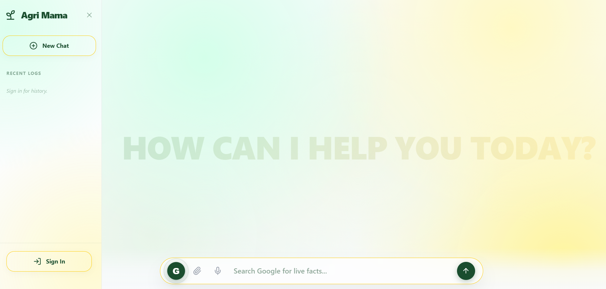
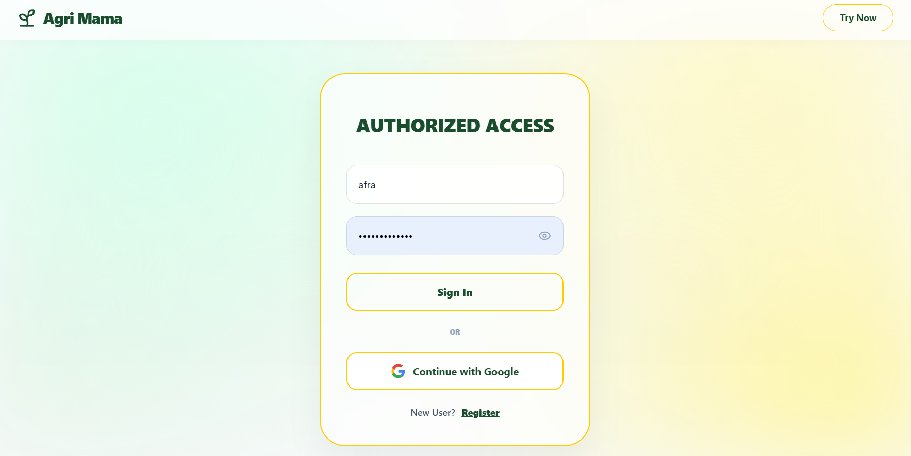
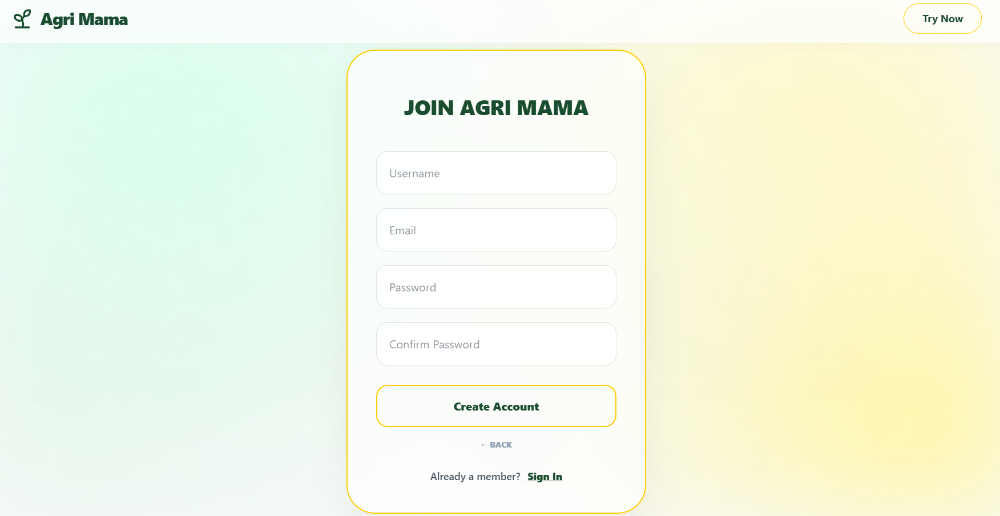

# Agri Mama: Next-Gen Multimodal Agriculture-Tech System

Agriculture in Bangladesh often feels like a game of luck because reliable information is so hard to find when it is needed most. Smallholder farmers find it difficult to identify genuine seeds or diagnose crop diseases accurately, while students and researchers struggle to navigate through endless, complex government documents. AgriMama AI was created to solve these exact problems. It offers a simple, all-in-one platform where anyone can just record a voice note in Bengali or upload a photo of a plant to get immediate expert advice. To make this possible, I built a high-performance backend using FastAPI that orchestrates a team of specialized AI agents, each an expert in their own field. To handle complex policies and research papers, I implemented a Retrieval-Augmented Generation (RAG) pipeline. This allows the system to "read" and extract precise answers from hundreds of pages of agricultural gazettes and scientific journals in seconds. Combined with Google Search grounding, the platform does not just make guesses. Instead, it provides verified, real-world answers backed by actual source links to prevent AI hallucinations. From tracking today’s wholesale market prices to finding organic farming tips, we are helping replace guesswork with reliable data, making agriculture more predictable and profitable for everyone.

---

##  Distributed System Architecture
The platform is built on a high-performance **Hybrid Microservices Stack**, separating user lifecycle management from heavy-duty AI orchestration.

<p align="center">
  
  
  
  
  
</p>

### The Core Logic
*   **Intelligent Routing:** Autonomous intent detection for Multimodal inputs (Voice/Image/PDF).
*   **Dual-Backend Sync:** Node.js manages secure user sessions and MongoDB history, while FastAPI drives the Agentic reasoning.
*   **Aurora Glassmorphism UI:** A premium, responsive interface designed for high accessibility and aesthetic clarity.

---

##  UI Preview

<p align="center">
  
  </p>
  <p align="center">
  
  </p>
  <p align="center">
  
    </p>
    <p align="center">
  
</p>
<p align="center">
  
  </p>
  <p align="center">
  
    </p>
    <p align="center">
  
</p>

---

##  Core Features: The 6-in-1 Agri-Intelligence Hub

AgriMama is engineered to handle the most critical information gaps in the agricultural lifecycle through six specialized modules.

###  1. AgriGuard: Precision Visual Diagnosis
Empowering farmers with a digital "Plant Doctor." By analyzing uploaded images of infected crops, the system utilizes **Vision LLMs** to detect pests and diseases. It provides immediate, step-by-step remedies—prioritizing organic solutions before suggesting safe chemical protocols.

###  2. SeedGuard: Anti-Counterfeit Verification
Combating the rise of sub-standard agricultural inputs. Using **OCR (Optical Character Recognition)**, AgriMama scans seed packet labels and cross-references brand data via **Google Search Grounding**. It verifies authenticity, batch validity, and expiration to protect the farmer's investment.

###  3. Ag-Gov Navigator: Policy & Subsidy Assistant
Simplifying the complexity of government bureaucracy. This module uses **RAG (Retrieval Augmented Generation)** to navigate dense PDF gazettes and official circulars. It provides clear, concise summaries of government subsidies, loan interest rates, and application procedures for Krishi Bank.

###  4. ClimateSmart: Real-time Market & Weather Analytics
Eliminating data asymmetry in the supply chain. AgriMama fetches localized, sub-second weather forecasts and live wholesale market prices. Crucially, every response is **grounded with live URLs**, allowing users to verify price points directly from the primary source.

###  5. BioComp: Circular Economy Assistant
Promoting sustainable farming through waste-to-value automation. This interactive guide assists users in converting household organic waste and farm residue into high-quality compost. It provides customized formulations based on the materials the farmer has available on-site.

###  6. AgriScholar: Academic Research Engine
A dedicated portal for the next generation of agronomists. AgriScholar summarizes peer-reviewed journals and academic research papers, translating complex scientific findings into digestible insights. It is optimized for students and researchers looking for data-driven evidence.

---

###  Built-in Safety & Verification Layer
Every feature listed above is passed through a mandatory **Evaluation Agent** (The Auditor). This ensures:
*   **Zero Hallucination:** All prices and policies are verified via Internet Grounding.
*   **Chemical Safety:** All pesticide recommendations include a standard toxicity warning.
*   **Accessibility:** Complex scientific jargon is simplified into "Farmer-Friendly" language (Bengali/English/Banglish).

---

##  Integrated Ecosystem & Models

To ensure sub-second latency and high-fidelity reasoning, AgriMama utilizes a curated selection of enterprise-grade APIs and frameworks.

| Service | Provider | Logic / Implementation | Documentation |
| :--- | :--- | :--- | :---: |
| **LLM Inference** | **Groq Cloud** | Ultra-fast token generation for specialized Multi-Agent logic. | [Link](https://console.groq.com/docs/) |
| **Agentic Framework** | **LangChain** | The core orchestrator for complex **Supervisor-Worker** workflows. | [Link](https://python.langchain.com/docs/) |
| **Search Grounding** | **Serper.dev** | High-speed **Google Search** integration for real-time verification. | [Link](https://serper.dev/docs) |
| **Neural Embeddings** | **HuggingFace** | Localized vector generation using `sentence-transformers` for RAG. | [Link](https://huggingface.co/docs) |
| **Audio Intelligence** | **OpenAI** | Industry-standard **Whisper v3** logic for seamless voice interaction. | [Link](https://platform.openai.com/docs/) |
| **Deep Discovery** | **Tavily AI** | Advanced AI-native search optimized for academic and research papers. | [Link](https://docs.tavily.com/) |
| **Data Persistence** | **MongoDB** | Distributed NoSQL storage for user profiles and secure chat history. | [Link](https://www.mongodb.com/docs/) |

###  Modern AI Tooling Highlights
*   **LangChain Orchestration:** Every agent decision, tool call, and state transition is managed via LangChain, providing a modular and scalable "Agentic" backbone.
*   **HuggingFace Integration:** By utilizing HuggingFace's open-source embedding models, we ensure that the **Retrieval Augmented Generation (RAG)** pipeline is both cost-effective and highly precise for local agricultural data.
*   **Hybrid Model Strategy:** We combine **OpenAI's** world-class speech processing with **Groq's** lightning-fast inference to create a multimodal experience with near-zero friction for the end user.

---

###  Models
AgriMama has been proactively migrated to the latest production models following Groq's ongoing model lifecycle updates:
*   **Logic Engine:** `openai/gpt-oss-120b`
*   **Visual Analysis:** `qwen/qwen3.6-27b` 
*   **Audio Transcription:** `whisper-large-v3` 
*   **Embedding:** `sentence-transformers/all-MiniLM-L6-v2`

---

##  Multi-Agent: The Supervisor Pattern
AgriMama operates through a tiered **Agentic Workflow** to prevent hallucinations and ensure data integrity:
1.  **Supervisor Agent:** Acts as the central orchestrator, parsing multimodal tags and routing queries.
2.  **Specialist Workers:** Dedicated agents (Farmer, Scholar, Policy, Vision) with specific tool-access and personas.
3.  **The Evaluator Layer:** A final auditing agent that reviews every response for **Safety, Simple Language, and Mandatory Source Citations.**

---

##  Monitoring & Transparency
Every execution within the AgriMama ecosystem is fully observable via **LangSmith**, ensuring 100% transparency in tool usage and agentic decision-making.
*   **[Public Trace: Multimodal Vision Flow]**
*   **[Public Trace: Google Grounding & Verification]**

---

##  Project Organization
```text
/agrimama
├── /frontend          # React.js SPA (Tailwind v4)
├── /backend-node      # Auth Middleware & MongoDB Logic
└── /backend-ai        # Agentic Intelligence Core (FastAPI)
    ├── /agents        # Specialized Multi-Agent Workers
    ├── /constants     # Unified System Prompts & Intent Keywords
    ├── /tools         # Custom OCR, Whisper, Search & RAG Tools
    ├── /ground_search # Proprietary Google Grounding Engine
    └── /knowledge_base # Curated Agricultural Knowledge & PDF Repository
```

---

##  Deployment Instructions
1.  **AI Engine:** `cd backend-ai && pip install -r requirements.txt && python main.py`
2.  **Auth Server:** `cd backend-node && npm install && npm start`
3.  **Client UI:** `cd frontend && npm install && npm run dev`

---

###  Engineering Credits
**Syeda Afra Anam**

**© 2026 Agri Mama. All Rights Reserved.**
*Engineered with a focus on Multimodality, Agentic Autonomy, and Real-World Reliability.*
